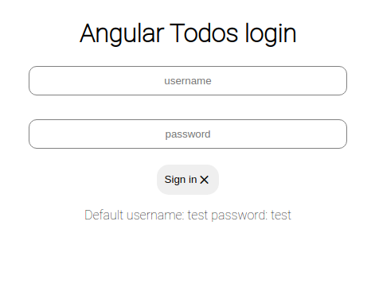
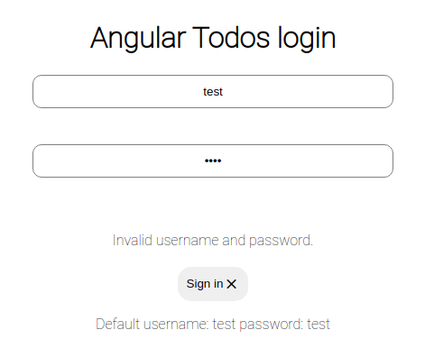
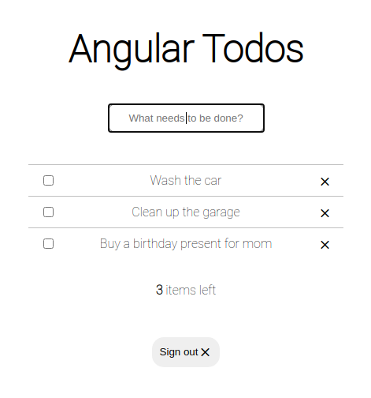
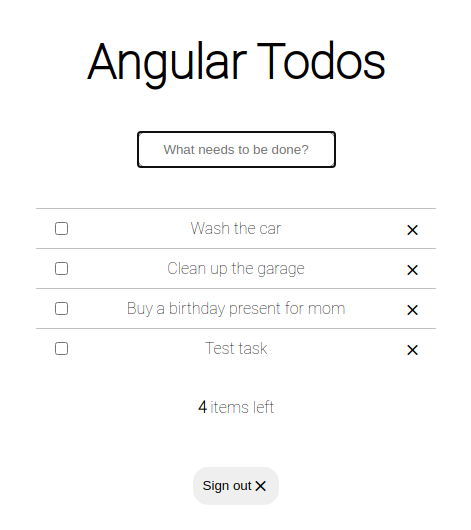

# Angular ToDoApp - simple 'todo app' created in Angular 2X with:

- angular components
- angular modules
- angular router
- scss
- REST Api (json-server)
- Simply token authentication

# Screenshots

## Login: 


## Login with validations:


## Login with validations #2:


## Main tasks page:


## New task added:



# Install and run

## Install npm modules
```bash
cd todo-app
npm install
```

## Run project
```bash
ng serve
```

## Run json-server
```bash
node json-server.js
```

## Open in brwoser
http://localhost:4200/sign-in

username: test
login: test

